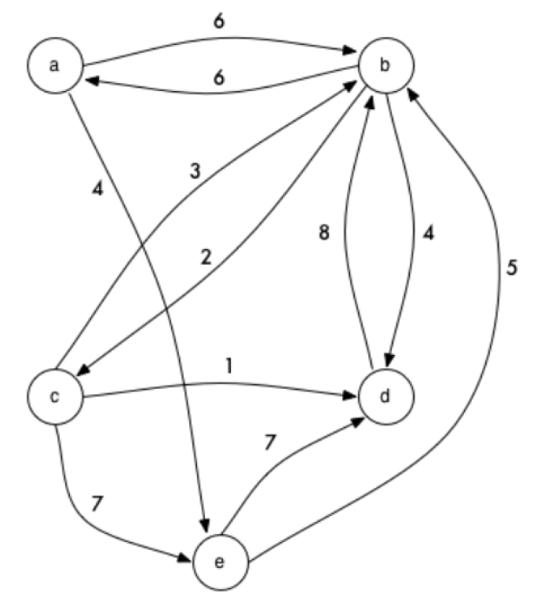

## Cenário
  
  
Uma empresa de transporte de carga e pessoal faz algumas rotas de entrega em um
grupo de cidades locais. Dada uma simplificação do modelo, todas as rotas entre essas cidades são unidirecionais.
Portanto, mesmo que de fato exista uma via bidirecional entre duas cidades,
as suas rotas não necessariamente terão a mesma distância de ida e de volta.


## Objetivo


Essa empresa deseja portanto conhecer as melhores rotas entre algumas cidades 
e suas devidas distâncias com o intuito de definir a melhor logística de trabalho.
Para isso a radix foi contratada com o intuito de prover Endpoints REST de algumas funcionalidades comuns. 


## Critério de aceitação

A entrada será dada como um grafo direcionado onde um nó representa uma cidade e uma aresta representa uma rota entre duas cidades. 
O peso da aresta representa então a distância dessa rota.
Uma dada rota jamais aparecerá mais de uma vez, e para uma dada rota, as cidades de origem e destino sempre serão diferentes.

Uma rota direcionada será dada como um objeto JSON, onde as cidades serão nomeadas usando letras do alfabeto [A-Z]. 
Exemplo: uma rota de A para B com distância 5 é representada como:

```javascript
{ 
  "source": "A",
  "target": "B",
  "distance":5
}
```



## Funcionalidades Esperadas (Especificação Funcional)

### Salvar Grafo

Esse endpoint deverá receber as arestas de um grafo e salva-las em um banco de dados para consultas posteriores.

* Endpoint: `http://localhost:8080/graph`
* HTTP Method: POST
* HTTP Success Response Code: CREATED (201)
* Contract:
  * Request payload

```javascript
{
  "data":[
    { 
      "source": "A", "target": "B", "distance":6
    },
    { 
      "source": "A", "target": "E", "distance":4
    },
    { 
      "source": "B", "target": "A", "distance":6
    },
    { 
      "source": "B", "target": "C", "distance":2
    },
    { 
      "source": "B", "target": "D", "distance":4
    },
    { 
      "source": "C", "target": "B", "distance":3
    },
    { 
      "source": "C", "target": "D", "distance":1
    },
    { 
      "source": "C", "target": "E", "distance":7
    },
    { 
      "source": "B", "target": "D", "distance":8
    },
    { 
      "source": "E",  "target": "B", "distance":5
    },
    { 
      "source": "E", "target": "D", "distance":7
    }
  ]
}
```

  * Response payload

```javascript
{
  "id" : 1,
  "data":[
    { 
      "source": "A", "target": "B", "distance":6
    },
    { 
      "source": "A", "target": "E", "distance":4
    },
    { 
      "source": "B", "target": "A", "distance":6
    },
    { 
      "source": "B", "target": "C", "distance":2
    },
    { 
      "source": "B", "target": "D", "distance":4
    },
    { 
      "source": "C", "target": "B", "distance":3
    },
    { 
      "source": "C", "target": "D", "distance":1
    },
    { 
      "source": "C", "target": "E", "distance":7
    },
    { 
      "source": "B", "target": "D", "distance":8
    },
    { 
      "source": "E",  "target": "B", "distance":5
    },
    { 
      "source": "E", "target": "D", "distance":7
    }
  ]
}
```

### Recuperar Grafo

Esse endpoint deverá retornar um grafo previamente salvo no banco de dados. Se o grafo não existe, deverá retornar HTTP NOT FOUND.

* Endpoint: `http://localhost:8080/graph/<graphId>`
* HTTP Method: GET
* HTTP Success Response Code: OK (200)
* HTTP Error Response Code: NOT FOUND (404)
* Contract:
  * Request payload: none

  * Response payload

```javascript
{
  "id" : 1,
  "data":[
    { 
      "source": "A", "target": "B", "distance":6
    },
    { 
      "source": "A", "target": "E", "distance":4
    },
    { 
      "source": "B", "target": "A", "distance":6
    },
    { 
      "source": "B", "target": "C", "distance":2
    },
    { 
      "source": "B", "target": "D", "distance":4
    },
    { 
      "source": "C", "target": "B", "distance":3
    },
    { 
      "source": "C", "target": "D", "distance":1
    },
    { 
      "source": "C", "target": "E", "distance":7
    },
    { 
      "source": "B", "target": "D", "distance":8
    },
    { 
      "source": "E",  "target": "B", "distance":5
    },
    { 
      "source": "E", "target": "D", "distance":7
    }
  ]
}
```

### Encontrar todas rotas disponíveis dada uma cidade de origem e outra de destino

Esse endpoint deverá calcular todas as rotas disponíveis de uma cidade origem para outra de destino, dado um número máximo de paradas. 
Se não existirem rotas possíveis, o resultado deverá ser uma lista vazia. Se o parâmetro "maxStops" não for definido, você deverá listar todas as rotas possíveis.

Exemplo: No grafo (AB5, BC4, CD8, DC8, DE6, AD5, CE2, EB3, AE7), as possíveis rotas de A para C com máximo de 3 paradas seriam: ["ABC", "ADC", "AEBC"]

* Endpoint: `http://localhost:8080/edges/from/<town1>/to/<town2>?maxStops=<maxStops>`
* HTTP Method: POST
* HTTP Response Code: OK (200)
* Contract:
  * Request payload

```javascript
{
  "data":[
    { 
      "source": "A", "target": "B", "distance":5
    },
    { 
      "source": "B", "target": "C", "distance":4
    },
    { 
      "source": "C", "target": "D", "distance":8
    },
    { 
      "source": "D", "target": "C", "distance":8
    },
    { 
      "source": "D", "target": "E", "distance":6
    },
    { 
      "source": "A", "target": "D", "distance":5
    },
    { 
      "source": "C", "target": "E", "distance":2
    },
    { 
      "source": "E", "target": "B", "distance":3
    },
    { 
      "source": "A", "target": "E", "distance":7
    }
  ]
}
```

  * Response payload

```javascript
{
  "edges": [
    {
      "edge": "ABC",
      "stops": 2
    },
    {
      "edge": "ADC",
      "stops": 2
    },
    {
      "edge": "AEBC",
      "stops": 3
    }
  ]
}
```

### Encontrar todas rotas disponíveis dada uma cidade de origem e outra de destino em um grafo salvo anteriormente

Esse endpoint deverá fazer exatamente o mesmo que o anterior, porém utilizando um grafo salvo anteriormente. Se o grafo não existir, deverá retornar HTTP NOT FOUND.

* Endpoint: `http://localhost:8080/edges/<graphId>/from/<town1>/to/<town2>?maxStops=<maxStops>`
* HTTP Method: POST
* HTTP Success Response Code: OK (200)
* HTTP Error Response Code: NOT FOUND (404)
* Contract:
  * Request payload: none
  * Response payload

```javascript
{
  "edges": [
    {
      "edge": "ABC",
      "stops": 2
    },
    {
      "edge": "ADC",
      "stops": 2
    },
    {
      "edge": "AEBC",
      "stops": 3
    }
  ]
}
```

### Determinar distância de um caminho específico

Esse endpoint deverá retornar a distância total de um caminho entre uma lista direcionada e específica de cidades. Caso a lista de cidades esteja vazia ou seja unitária, o resultado deverá ser zero. Se o dado caminho não existir, então o resultado deverá ser -1.

* Endpoint: `http://localhost:8080/distance`
* HTTP Method: POST
* HTTP Response Code: OK (200)
* Contract:
  * Request payload

```javascript
{
  "path":["A", "B", "C", "D"],
  "data":[
    { 
      "source": "A", "target": "B", "distance":6
    },
    { 
      "source": "A", "target": "E", "distance":4
    },
    { 
      "source": "B", "target": "A", "distance":6
    },
    { 
      "source": "B", "target": "C", "distance":2
    },
    { 
      "source": "B", "target": "D", "distance":4
    },
    { 
      "source": "C", "target": "B", "distance":3
    },
    { 
      "source": "C", "target": "D", "distance":1
    },
    { 
      "source": "C", "target": "E", "distance":7
    },
    { 
      "source": "B", "target": "D", "distance":8
    },
    { 
      "source": "E",  "target": "B", "distance":5
    },
    { 
      "source": "E", "target": "D", "distance":7
    }
  ]
}
```

  * Response payload

```javascript
{
  "distance" : 9
}
```

### Determinar distância de um caminho específico em um grafo salvo

Esse endpoint deverá fazer exatamente o mesmo que o anterior, porém utilizando um grafo salvo anteriormente. Se o grafo não existir, deverá retornar HTTP NOT FOUND.

* Endpoint: `http://localhost:8080/distance/<graphId>`
* HTTP Method: POST
* HTTP Success Response Code: OK (200)
* HTTP Error Response Code: NOT FOUND (404)
* Contract:
  * Request payload

```javascript
{
  "path":["A", "B", "C", "D"]
}
```

  * Response payload

```javascript
{
  "distance" : 9
}
```

### Determinar a distância mínima entre duas cidades

Esse endpoint deverá determinar a rota cuja distância seja a mínima possível entre duas cidades. Se as cidades de origem e destino forem iguais, o resultado deverá ser zero. Se não exitir rota possível entre as duas cidades, então o resultado deverá ser -1.

* Endpoint: `http://localhost:8080/distance/from/<town1>/to/<town2>`
* HTTP Method: POST
* HTTP Response Code: OK (200)
* Contract:
  * Request payload

```javascript
{
  "data":[
    { 
      "source": "A", "target": "B", "distance":6
    },
    { 
      "source": "A", "target": "E", "distance":4
    },
    { 
      "source": "B", "target": "A", "distance":6
    },
    { 
      "source": "B", "target": "C", "distance":2
    },
    { 
      "source": "B", "target": "D", "distance":4
    },
    { 
      "source": "C", "target": "B", "distance":3
    },
    { 
      "source": "C", "target": "D", "distance":1
    },
    { 
      "source": "C", "target": "E", "distance":7
    },
    { 
      "source": "B", "target": "D", "distance":8
    },
    { 
      "source": "E",  "target": "B", "distance":5
    },
    { 
      "source": "E", "target": "D", "distance":7
    }
  ]
}
```

  * Response payload

```javascript
{
  "distance" : 8,
  "path" : ["A", "B", "C"]
}
```

### Determinar a distância mínima entre duas cidades em um grafo salvo

Esse endpoint deverá fazer exatamente o mesmo que o anterior, porém utilizando um grafo salvo anteriormente. Se o grafo não existir, deverá retornar HTTP NOT FOUND.

* Endpoint: `http://localhost:8080/distance/<graphId>/from/<town1>/to/<town2>`
* HTTP Method: POST
* HTTP Success Response Code: OK (200)
* HTTP Error Response Code: NOT FOUND (404)
* Contract:
  * Request payload: none

  * Response payload

```javascript
{
  "distance" : 8,
  "path" : ["A", "B", "C"]
}
```

## Dados para Teste

Grafo Entrada:
AB5, BC4, CD8, DC8, DE6, AD5, CE2, EB3, AE7

Casos de Teste:
1. Distância da Rota ABC: 9
2. Distância da Rota AD: 5
3. Distância da Rota ADC: 13
4. Distância da Rota AEBCD: 22
5. Distância da Rota AED: -1 (Inexistente)
6. Rotas de origem C e destino C com um maximo de 3 paradas: 
	- C  (0 paradas)
7. Rotas de origem A e destino C com um maximo de 4 paradas:
	- ABC   (2 paradas)
	- ADC   (2 paradas)
	- AEBC  (3 paradas)
	- ADEBC (4 paradas)
8. Distância mínima de A para C: ABC  (distância = 9)
9. Distância mínima de B para B: B (distância = 0)

